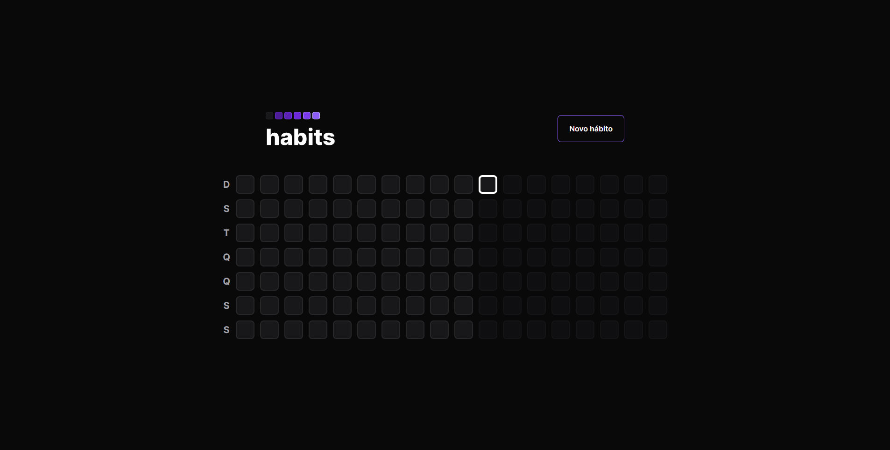
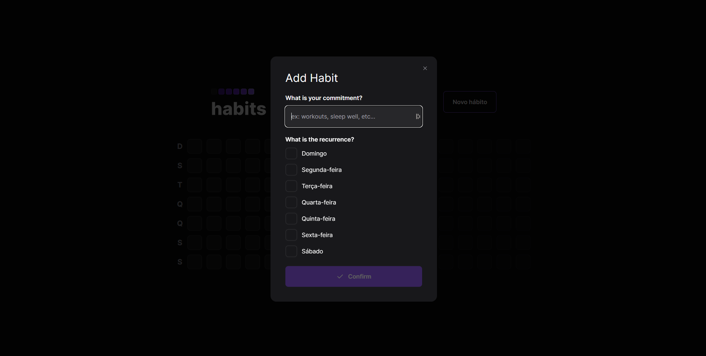
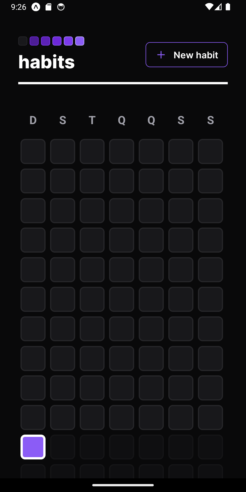
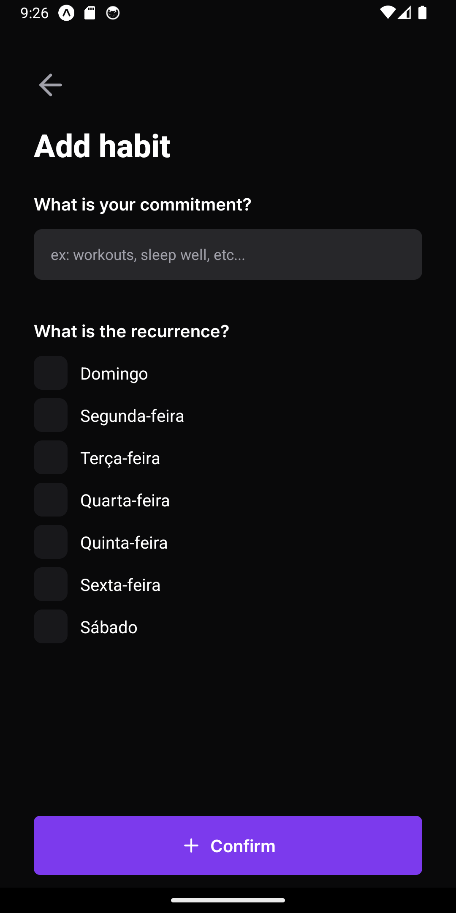

# Habit Tracker


**Habit Tracker** is an app designed to help you track and maintain your daily habits throughout the year. Available as both a mobile app and web version, Habit Tracker offers a unified, accessible experience on any device. This project was developed as part of a hands-on session during the NLW Ignite (Rocketseat).

## Credits

This project was developed based on the knowledge acquired through courses and educational materials provided by [rocketseat](https://www.rocketseat.com.br). Rockseat offers a wide range of high-quality courses and content for developers in various areas, including design, programming, and app development.

We would like to thank the Rockseat team for providing valuable educational resources that contributed to the development of this project.

For more information about the courses and materials offered by Rockseat, please visit the official website at [rocketseat](https://www.rocketseat.com.br).

🎨 [Figma do projeto](https://www.figma.com/community/file/1195326661124171197)

## Technology

The following are the key technologies and tools used in the development of this project:

### Server

- **NodeJS**: Is a JavaScript runtime built on Chrome's V8 JavaScript engine.
- **Fastify**: Is a web framework highly focused on providing the best developer experience with the least overhead and a powerful plugin architecture.
- **Prisma**: Is a next-generation ORM that consists of these tools:

Prisma Client: Auto-generated and type-safe query builder for Node.js & TypeScript
Prisma Migrate: Declarative data modeling & migration system
Prisma Studio: GUI to view and edit data in your database

- **Zod**: Is a TypeScript-first schema declaration and validation library. I'm using the term "schema" to broadly refer to any data type, from a simple string to a complex nested object.

### Mobile

- **React Native**: It's a mobile app development framework that allows you to build native apps for iOS and Android using JavaScript and React. It enables mobile app development with a single codebase, providing a native user experience.
- **Expo**: It's an open-source platform and set of tools for building native mobile apps using JavaScript and React Native. Expo provides a range of ready-to-use components and APIs that streamline app development, including access to features like camera, geolocation, and push notifications.
- **Nativewind**: NativeWind uses Tailwind CSS as scripting language to create a universal style system for React Native. NativeWind components can be shared between platforms and will output their styles as CSS StyleSheet on web and StyleSheet.create for native.
- **Axios**: Is a simple promise based HTTP client for the browser and node.js. Axios provides a simple to use library in a small package with a very extensible interface.
- **Dayjs**: Is a minimalist JavaScript library that parses, validates, manipulates, and displays dates and times for modern browsers with a largely Moment.js-compatible API.

### Web

- **ReactJS**: It's a mobile app development framework that allows you to build native apps for iOS and Android using JavaScript and React. It enables mobile app development with a single codebase, providing a native user experience.

## How It Works

### Continuous Calendar:

The app features a continuous calendar that spans all the days from the previous year to the present. This provides a comprehensive view of your progress over time, from established habits to new challenges ahead.
Days prior to the current day are fully accessible, allowing you to record your habits as needed. This enables you to reflect on your history and see how consistent you've been over time.
Future days are blocked to prevent premature recordings. This encourages focus on the present and prevents users from "cheating" by recording habits before they are completed. Thus, you're encouraged to live each day as it comes and stay committed to your daily goals.

### Habit Tracking:

For each accessible day on the calendar, you can record the habits you've completed. Habits are represented as items that can be checked or unchecked, indicating whether they've been fulfilled or not.
You can easily mark a habit as completed by tapping or clicking on the corresponding item on the calendar.

### Adding New Habits:

In addition to existing habits, you have the option to add new habits to your calendar. This allows you to customize your tracking experience according to your specific needs and goals.
When adding a new habit, you can set its name, frequency, and which days of the week you intend to perform it.

### Habit Management:

The app offers complete habit management features, including the ability to edit or delete existing habits.
You can adjust the details of each habit, such as its name, frequency, or the specific days on which you intend to perform the activity.

## Screenshots

### Web

#### Home (calendar)



#### Add New Habit



#### Edit Habit


### Mobile

#### Home (calendar)



#### Add New Habit



#### Edit Habit


## Installation

To run the app locally, follow these steps:

Clone the repository:

```bash
git clone https://github.com/edsoncamargo/my-goals-app
cd your-path/my-goals-app
```

Next, follow the steps below:

### Web

1. Install the dependencies:

   ```bash
   cd web
   npm install
   ```

2. Start the app:

   ```bash
   npx start
   ```

### Mobile

1. Install the dependencies:

   ```bash
   cd mobile
   npm install
   ```

2. Start the web:

   ```bash
   npx expo start
   ```

3. Scan the QR code using the Expo Go app on your mobile device or use an emulator to test the app.

### Server

1. Install the dependencies:

   ```bash
   cd server
   npm install
   ```

2. Start the database:

   ```bash
   npx prisma migrate deploy
   ```

3. Start the server:

   ```bash
   npm run serve
   ```

## Contribution

You are welcome to contribute to the development of this project. If you find bugs, wish to add new features, or improve usability, feel free to open an issue or submit a pull request.

## Contact

- Name: Edson Camargo Menezes
- Email: contact@edsoncamargo.dev

## Acknowledgments

Special thanks to everyone who contributed to making this app a reality, especially Rocketseat for their invaluable support and guidance throughout the development process. Your expertise and dedication have been instrumental in bringing this project to fruition.

Enjoy using **Habit Tracker!**
